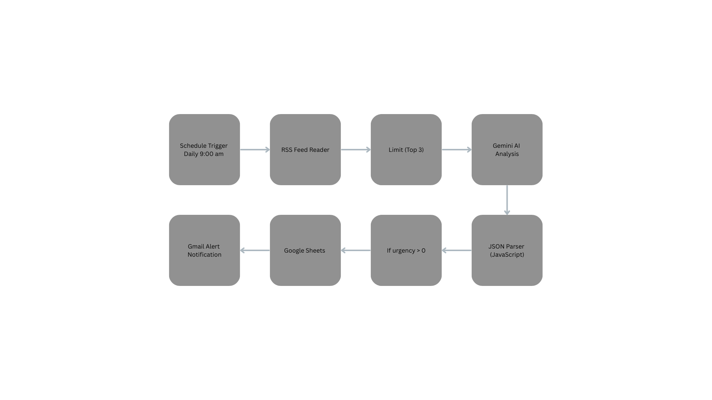

# PFAS Compliance Monitoring Bot

An automated n8n workflow that monitors regulatory news about PFAS (Per- and Polyfluoroalkyl Substances) and REACH compliance, analyzes content using AI, and delivers prioritized alerts.

## Overview

This workflow automates the monitoring of environmental compliance regulations by:
- Scanning news sources for PFAS and REACH regulation updates
- Using Google Gemini AI to analyze and summarize findings
- Logging results to Google Sheets for tracking
- Sending email alerts for urgent regulatory changes

## Workflow Architecture

<p align="center">
  
</p>

## Features

- **Automated Scheduling**: Runs daily at 9 AM to check for new regulatory updates
- **Smart RSS Monitoring**: Fetches latest news from Google News RSS for PFAS and REACH regulations
- **AI-Powered Analysis**: Uses Google Gemini to extract:
  - Whether the regulation is new
  - Urgency level (1-10 scale)
  - Concise summary (max 15 words)
- **Data Logging**: Automatically appends findings to a Google Sheet for record-keeping
- **Email Alerts**: Sends prioritized notifications for urgent regulatory changes

## Prerequisites

- [n8n](https://n8n.io/) (self-hosted or cloud)
- Google Cloud account with the following APIs enabled:
  - Gmail API
  - Google Sheets API
  - Google Gemini (PaLM) API
- OAuth2 credentials configured in n8n for:
  - Google Sheets
  - Gmail
- API key for Google Gemini

## Installation

1. **Import the Workflow**
   - Open your n8n instance
   - Go to Workflows → Import from File
   - Select `pfas-compliance-bot.json`

2. **Configure Credentials**
   - Set up Google Sheets OAuth2 credentials
   - Set up Gmail OAuth2 credentials
   - Add your Google Gemini API key

3. **Update Configuration**
   - Update the Google Sheet document ID in the "Append row in sheet" node
   - Update the recipient email address in the "Send a message" node

4. **Activate the Workflow**
   - Toggle the workflow to active
   - The bot will run automatically at 9 AM daily

## Configuration

### Google Sheet Setup

Create a Google Sheet with the following columns:
| Summary | Urgency |
|---------|---------|
| (text)  | (number)|

### Email Customization

The email alert includes:
- **Subject**: `PFAS Alert - Level {urgency}`
- **Body**: AI-generated summary of the regulation

## How It Works

1. **Trigger**: The workflow activates daily at 9 AM
2. **Fetch News**: Reads the latest 3 articles from Google News RSS feed searching for "PFAS compliance" and "REACH regulation"
3. **AI Analysis**: Each article is processed by Google Gemini, which extracts structured data:
   ```json
   {
     "is_new": true,
     "urgency": 8,
     "summary": "New EPA restriction on PFAS imports."
   }
   ```
4. **Filter**: Only items with urgency > 0 proceed
5. **Log**: Results are appended to Google Sheets
6. **Notify**: Email alert is sent with the summary and urgency level

## Nodes Overview

| Node | Type | Purpose |
|------|------|---------|
| Schedule Trigger | Trigger | Initiates workflow daily at 9 AM |
| RSS Read | Input | Fetches Google News RSS feed |
| Limit | Transform | Restricts processing to top 3 items |
| Basic LLM Chain | AI | Sends content to Gemini for analysis |
| Google Gemini Chat Model | AI | LLM configuration |
| Code in JavaScript | Transform | Parses AI JSON response |
| If | Logic | Filters by urgency threshold |
| Append row in sheet | Output | Logs to Google Sheets |
| Send a message | Output | Sends Gmail notification |

## Customization

- **Schedule**: Modify the Schedule Trigger node to change execution time
- **Search Terms**: Edit the RSS URL to monitor different topics
- **Urgency Threshold**: Adjust the If node condition
- **AI Prompt**: Customize the extraction prompt in the Basic LLM Chain node

## Author

**Aaron Chopade**
---

*Built with [n8n](https://n8n.io/) - the workflow automation platform*
